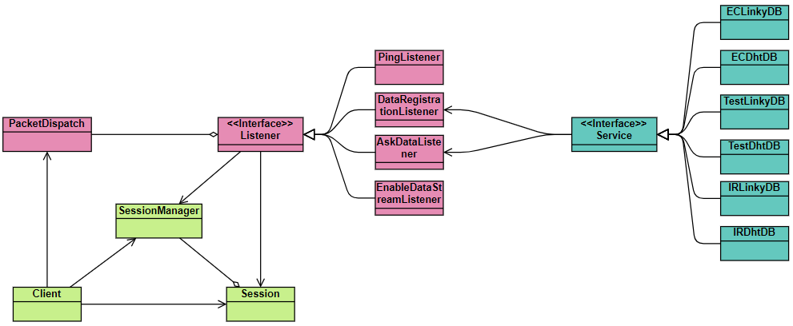

# Service Linky Et DHT

## Présentation

Ce projet est un service de données créé lors du projet de fin de seconde année de BTS SN EC.  
Il met à disposition deux services :
- Un service pour les données d’un compteur Linky (téléinfo)
- Un service pour la température et l’humidité (basé sur un DHT11)

Le service permet l’enregistrement de nouvelles données. Il permet aussi l’accès des données de deux manières :
- Obtention de toutes les données qu’il contient
- Obtention en flux des nouvelles données enregistrées en temps réel

## Fonctionnement

Le programme a été fait en java et la gestion des dépendances est fait avec Maven.  
Voici le diagramme de classe simplifié du programme:

En vert : Gestion des clients web socket  
En rose : Système d’interprétation des paquets JSON  
En bleu : Le système de stockage  

### Communication avec le service

L’application est construite pour communiquer avec un système de paquets formatés en JSON. Ces deux technologies sont très courantes et simples à utiliser.  
Voici une liste des principaux paquets utilisé :

| Nom | Type | Description |
|-----|------|-------------|
|ask\_data|IN|Demande de l’ensemble des données enregistrées pour le service désigné|
|data\_registration|IN|Ajout d’une valeur sur le service désigné, le temps est défini par le service pour éviter toutes incohérences|
|enable\_data\_stream|IN|Permet d’activer un flux qui transmet les nouvelles données enregistrées en temps réel et sur le service correspondant|
|ping|OUT|Paquet de test, le serveur doit répondre un paquet pong|
|data\_response|OUT|Réponse du paquet ask\_data|
|new\_data\_registration|OUT|Transmet une nouvelle donnée reçue par le serveur au client s’il a activé le flux de données au service correspondant|
|data\_response|OUT|Réponse à un paquet ping|

Tous les paquets sauf celui du "ping" et du "pong" ont deux clés en commun :
- "packet" : Identifiant du paquet (les mêmes que dans le tableau ci-dessus)
- "service" : Sert à préciser le service concerné ("dht" ou "linky")

Si des données sont présentes, elles sont dans un objet JSON nommé "data".

### Stockage et accès des données

Trois types de stockage ont été prévus mais seulement deux sont implémentés :
- MySQL : Base donnée SQL classique
- Test : il a pour but de simuler une implémentation fonctionnelle
- EC IR : c’est celle qui n’a pas été implémentée pour l’instant car elle dépend du groupe de l’option informatique et réseau.

## Configuration

La configuration offre la possibilité de choisir le mode de stockage, de changer d’url et de port du server web socket et de modifier les informations de connexion MySQL. Des commentaires ont été placés dans le fichier, par défaut, pour une meilleure compréhension. Si une ligne est supprimée, celle par défaut sera utilisée. Une mauvaise modification peut entrainer des erreur. Elles sont généralement assez claires pour connaitre la cause du problème et le régler.

## Points à améliorer

### Grands nombres de données

Si on considère qu’une nouvelle entrée de donnée est enregistrée toutes les secondes, le nombre donné pour un seul service au bout d’un siècle serait d’environ de 3 milliards. Le programme ne fonctionnera sûrement pas plus d’une semaine car c’est un projet scolaire, mais gérer une très grande quantité de données en temps réel, est l'un des principes d’un service de données.  
Le problème actuel est que si nous faisons une demande de données sur un service de l’application, il nous retourne l’ensemble des valeurs existantes. Le problème est assez évident, le transfert de données peut-être très long. Pour information, j’ai constaté que l’acquisition par le service prend 20 secondes pour obtenir 7 millions de valeurs du service DHT. Ce qui est considérable, en sachant qu’il faut en plus formater les valeurs en JSON et les transmettre en web socket.  
Il y a quelques solutions pour régler ce problème :

#### Compression des données 
Faire un cache de données et les transmettre au client en fichiers compressés. Mais cela complexifie le système de paquet qui est actuellement simple.
#### Fusionner les données en valeurs moyennes
Faire les valeurs moyennes des données de tous les X temps peut réduire grandement le nombre de données à transmettre. Mais cela dépend de l’échelle d’analyse des données que le client souhaite.
#### Transmission par fourchette
Lors de la demande de données on indique une fourchette de temps. De cette façon, le client reçoit les valeurs qui lui sont utiles pour un temps donné. De plus, cela de change rien au problème si le client souhaite traiter les données sur une grande échelle de temps.
#### Solution préférée
Pour régler le problème, la mise en place des deux dernières solutions serait la plus adaptée. Même si le client à besoin d’une grande quantité de données, par exemple, pour faire un graphique de l’ensemble des données, il lui suffirait de faire des valeurs moyennes par jour, voire par semaine, et utiliser une fourchette pour avoir des détails sur un temps donné.
### Unit Test
Le programme ne comporte quasiment aucune unité de test. Bien que cela pourrait apporter au programme, une meilleure fiabilité, une sûreté et un gain de temps sur le long terme. Mes compétences ne sont pas encore au point pour la construction d’unité de test pertinente.